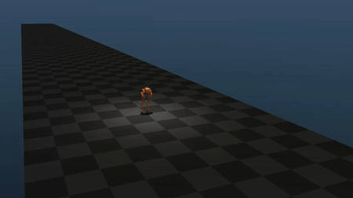
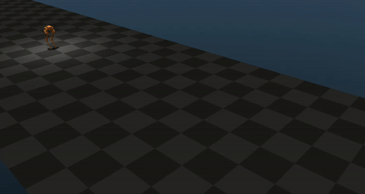

# CassieRL-Bipedal Locomotion

A small, modular library that contains some implementations of PPO. Fully compatible with OpenAI gym.

Original repository: https://github.com/osudrl/apex





## Environment

Ubuntu 20.04、MuJoCo 200、Python 3.10

Create conda environment
``` Bash
conda create -n cassie python=3.10
conda activate cassie
```

Install required Python packages
``` Bash
conda install pytorch torchvision torchaudio pytorch-cuda=11.8 -c pytorch -c nvidia
pip install scipy matplotlib pandas lxml tensorboard ray
```

### MuJoCo
Download [mujoco200](https://www.roboti.us/download.html) and [Activation key](https://www.roboti.us/license.html) to path `~/.mujoco`

Then add `export MUJOCO_KEY_PATH=/home/xxx/.mujoco/mjkey.txt` to the end of `~/.bashrc`


## Running experiments

### Basics
Any algorithm can be run from the train.py entry point.

To run PPO on a cassie environment,
``` Bash
python train.py ppo --env_name Cassie-v0 --num_procs 12 --run_name experiment01
```


To continue training existing models
``` Bash
python train.py ppo --n_itr 1000 --num_procs 4 --run_name experiment03 --previous ${parent/path/of/actor.pt}
```

To test the trained models
``` Bash
python train.py eval --path ${parent/path/of/actor.pt}
```

## Logging details / Monitoring live training progress
Tensorboard logging is enabled by default for all algorithms. The logger expects that you supply an argument named ```logdir```, containing the root directory you want to store your logfiles in, and an argument named ```seed```, which is used to seed the pseudorandom number generators.

A basic command line script illustrating this is:

``` Bash
python train.py ars --logdir logs/ars --seed 1337
```

The resulting directory tree would look something like this:
```
trained_models/                         # directory with all of the saved models and tensorboard logs
└── ars                                 # algorithm name
    └── Cassie-v0                       # environment name
        └── 8b8b12-seed1                # unique run name created with hash of hyperparameters
            ├── actor.pt                # actor network for algo
            ├── critic.pt               # critic network for algo
            ├── events.out.tfevents     # tensorboard binary file
            ├── experiment.info         # readable hyperparameters for this run
            └── experiment.pkl          # loadable pickle of hyperparameters
```

Using tensorboard makes it easy to compare experiments and resume training later on.

To see live training progress

Run ```$ tensorboard --logdir logs/``` then navigate to ```http://localhost:6006/``` in your browser

## Cassie Environments:
* `Cassie-v0` : basic unified environment for walking/running policies
* `CassieTraj-v0` : unified environment with reference trajectories
* `CassiePlayground-v0` : environment for executing autonomous missions
* `CassieStanding-v0` : environment for training standing policies

## Algorithms:
#### Currently implemented:
* [PPO](https://arxiv.org/abs/1707.06347), VPG with ratio objective and with log likelihood objective
* Entropy based exploration bonus
* advantage centering (observation normalization WIP)

#### To be implemented long term:
* CUDA support

## Acknowledgements

Thanks to @ikostrikov's whose great implementations were used for debugging. Also thanks to @rll for rllab, which inspired a lot of the high level interface and logging for this library, and to @OpenAI for the original PPO tensorflow implementation. Thanks to @sfujim for the clean implementations of TD3 and DDPG in PyTorch. Thanks @modestyachts for the easy to understand ARS implementation.
